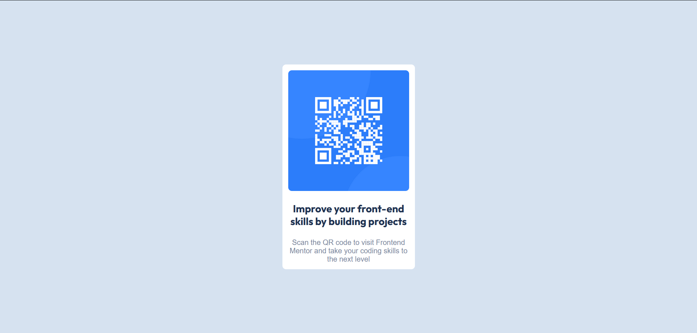
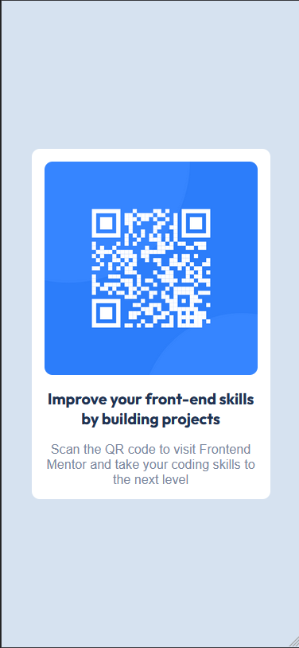

# fem-qr-code-component
Frontend Mentor Challenge - QR Code Component

# Frontend Mentor - QR code component solution

This is a solution to the [QR code component challenge on Frontend Mentor](https://www.frontendmentor.io/challenges/qr-code-component-iux_sIO_H). Frontend Mentor challenges help you improve your coding skills by building realistic projects. 

## Table of contents

- [Overview](#overview)
  - [Screenshot](#screenshot)
  - [Links](#links)
- [My process](#my-process)
  - [Built with](#built-with)
  - [What I learned](#what-i-learned)
  - [Continued development](#continued-development)
  - [Useful resources](#useful-resources)
- [Author](#author)
- [Acknowledgments](#acknowledgments)

**Note: Delete this note and update the table of contents based on what sections you keep.**

## Overview

### Screenshot


<!-- ](./screenshot.jpg) -->

### Links

- Solution URL: [Add solution URL here](https://your-solution-url.com)
- Live Site URL: [Add live site URL here](https://your-live-site-url.com)

## My process

### Built with

- Semantic HTML5 markup
- CSS custom properties
- Flexbox
- CSS Grid
- Mobile-first workflow
- [Sass](https://sass-lang.com/) - Sass Website


### What I learned

I basically built this in about half a day just to exercise my sass and html markup skills. I had a bit of block getting the elements to center on the page. Once past that everything else fell into place


```html
<h1>Some HTML code I'm proud of</h1>
<p>I enjoy some of the methodology of CUBE css so I try and use that. I also try and limit how many classes I use. If it's not necessary I will just call the element in the css.</p>
<p> That's why the hgroup does not have a class</p>
<p>I also wrap my images in </p>

 <main id="main" class="[ main ]">
    <section class="[ wrapper ]">
      <div class="[ img_wrapper ]">
        
      </div>
      <hgroup>
        <h2>
          Improve your front-end skills by building projects
        </h2>
        <p>
          Scan the QR code to visit Frontend Mentor and take your coding skills to the next level
        </p>
      </hgroup>
    </section>
  </main>
```

### Continued development

Think I may change the image tag to a picture element possibly and further improve my sass stylesheets

## Author

- Website - [Landry Barb II](https://landrybarb.com/)
- Frontend Mentor - [@LandryBarb](https://www.frontendmentor.io/profile/yourusername)
- GitHub - [LandryBarb](https://github.com/LandryBarb)

